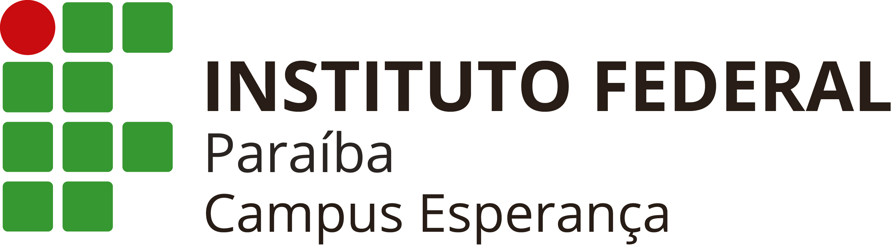

<p align="center">
  
</p>

# Resolução de Exercícios - Programação em Dispositivos Móveis (PDM)

Este repositório reúne uma série de atividades desenvolvidas durante a disciplina de [Programação em Dispositivos Móveis](https://estudante.ifpb.edu.br/media/cursos/346/disciplina/PDM.pdf), oferecida no curso de Análise e Desenvolvimento de Sistemas.

## 📱 Sobre o Projeto

O objetivo do repositório é registrar o progresso das práticas realizadas em sala, explorando os fundamentos do desenvolvimento mobile com foco em aplicações modernas, interativas e escaláveis.

## 📁 Organização

O repositório está organizado por diretórios nomeados conforme o exercício ou aula. Dentro de cada pasta há os arquivos e códigos relacionados à atividade correspondente.

- [Atividade-1](./gerenciador-tarefas/)
- [Atividade-2](./calculadora/)
- [Atividade-3](./tictac-toe/)

## 🛠 Tecnologias Utilizadas

- **Linguagem:** TypeScript
- **Framework:** React Native
- **Plataforma:** Expo
- **Editor:** Visual Studio Code

## 🚀 Como Executar

1. Clone o repositório:
   ```bash
   git clone https://github.com/GuilhermexL/exercicios-pdm.git
   ```

2. Acesse o diretório do projeto:
   ```bash
   cd exercicios-pdm/nome-da-pasta
   ```

3. Instale as dependências:
   ```bash
   npm install
   ```

4. Inicie o projeto com Expo:
   ```bash
   npx expo start
   ```

> Certifique-se de ter o [Node.js](https://nodejs.org/), [Expo CLI](https://docs.expo.dev/get-started/installation/), e o [VS Code](https://code.visualstudio.com/) instalados.